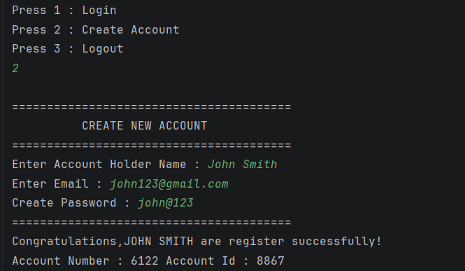
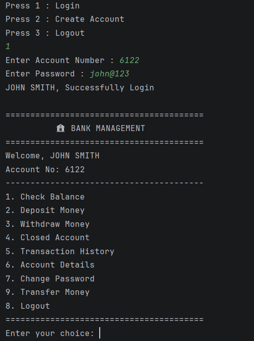
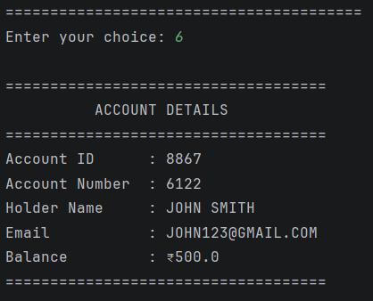
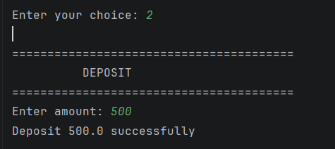

# 🏦 Bank Management System

A **console-based Bank Management System** built with **Java, JDBC, and MySQL**.
The project demonstrates core backend development concepts such as **OOP, DAO pattern, Service Layer, database transactions, password hashing, validation, and CRUD operations**.

## 🚀 Features

* 👤 Create a new bank account
* 🔐 Secure password hashing using BCrypt
* 🔑 User login authentication
* 💰 Check account balance
* ➕ Deposit money
* ➖ Withdraw money
* 💸 Transfer money between accounts
* 👤 View account details
* ✏️ Update account name
* 📧 Update account email
* 🔑 Reset/change password
* 🗑️ Close bank account
* 🔄 Database transaction handling using `commit()` and `rollback()`
* 🔒 Database credentials loaded through environment variables

## 🛠️ Technologies Used

| Technology | Purpose                 |
| ---------- | ----------------------- |
| Java       | Application development |
| JDBC       | Database connectivity   |
| MySQL      | Data storage            |
| BCrypt     | Password hashing        |
| Git        | Version control         |
| GitHub     | Source code hosting     |

## 🏗️ Project Architecture

The project follows a layered architecture to separate responsibilities.

```text
                    ┌─────────────────┐
                    │     User        │
                    └────────┬────────┘
                             │
                             ▼
                    ┌─────────────────┐
                    │   Dashboard     │
                    │   (UI Layer)    │
                    └────────┬────────┘
                             │
                             ▼
                    ┌─────────────────┐
                    │  BankService    │
                    │ (Business Logic)│
                    └────────┬────────┘
                             │
                             ▼
                    ┌─────────────────┐
                    │   AccountDAO    │
                    │  (Data Access)  │
                    └────────┬────────┘
                             │
                             ▼
                    ┌─────────────────┐
                    │     MySQL       │
                    │    Database     │
                    └─────────────────┘
```

## 📂 Project Structure

```text
src/
│
├── DAO/
│   └── AccountDAO.java
│
├── Dashboard/
│   └── Dashboard.java
│
├── Model/
│   └── Account.java
│
├── Service/
│   └── BankService.java
│
├── Util/
│   ├── ConnectionManager.java
│   ├── NumberGenerator.java
│   └── PasswordUtil.java
│
└── Main.java
```

## 📸 Screenshots

Below are some screenshots of the application in action.

<table>
  <tr>
    <td align="center">
      <b>👤 Account Creation</b><br><br>
      
    </td>
    <td align="center">
      <b>🏦 Bank Management Dashboard</b><br><br>
      
    </td>
  </tr>

  <tr>
    <td align="center">
      <b>📋 Account Details</b><br><br>
      
    </td>
    <td align="center">
      <b>💰 Deposit Money</b><br><br>
      
    </td>
  </tr>
</table>

### 📦 Model

`Account.java`

Represents the account entity and contains account-related data such as:

* Account ID
* Account number
* Account holder name
* Email
* Password
* Balance

### 🗄️ DAO Layer

`AccountDAO.java`

Responsible for communicating with the MySQL database.

Examples of database operations:

```text
Create Account
Find Account
Update Balance
Update Account Information
Delete Account
Reset Password
```

### ⚙️ Service Layer

`BankService.java`

Contains the application's business logic.

Examples:

```text
Register Account
Login
Deposit
Withdraw
Transfer Money
Get Account Details
Update Account
Close Account
Reset Password
```

### 🖥️ Dashboard

`Dashboard.java`

Handles user interaction through the console and provides menus for different banking operations.

### 🔧 Utility Classes

#### `ConnectionManager.java`

Creates JDBC connections to the MySQL database.

Database credentials are read from environment variables instead of being hardcoded.

#### `PasswordUtil.java`

Handles password hashing and verification using BCrypt.

#### `NumberGenerator.java`

Generates account numbers for newly created accounts.

---

# 💸 Money Transfer & Database Transactions

The money transfer operation uses a database transaction.

The basic flow is:

```text
Start Transaction
       │
       ▼
Debit sender
       │
       ▼
Credit receiver
       │
       ▼
Both operations successful?
      / \
    YES  NO
     │    │
     ▼    ▼
  COMMIT ROLLBACK
```

The application uses:

```java
connection.setAutoCommit(false);
```

and then either:

```java
connection.commit();
```

or:

```java
connection.rollback();
```

This prevents a situation where money is deducted from one account but not credited to the other.

---

# 🔐 Password Security

Passwords are not stored directly as plain text.

The project uses **BCrypt hashing**:

```text
User Password
      │
      ▼
 BCrypt Hash
      │
      ▼
Database
```

During login, the entered password is compared against the stored BCrypt hash.

---

# 🔒 Environment Variables

Database credentials should not be hardcoded into the source code.

The application reads:

```text
DB_URL
DB_USERNAME
DB_PASSWORD
```

from environment variables.

Example:

```text
DB_URL=jdbc:mysql://localhost:3306/bank_management
DB_USERNAME=root
DB_PASSWORD=your_password
```

> Never commit your real database password or `.env` file containing secrets to GitHub.

---

# 🗄️ Database Setup

## 1. Install MySQL

Install MySQL Server and make sure the MySQL service is running.

## 2. Create the database

```sql
CREATE DATABASE bank_management;
```

Select the database:

```sql
USE bank_management;
```

Create the required `accounts` table according to the SQL structure used by the project.

> Keep database credentials outside the repository.

---

# ▶️ How to Run

### 1. Clone the repository

```bash
git clone https://github.com/AnkitSirsatia/Bank_Management_System.git
```

### 2. Open the project

Open the project in your preferred Java IDE such as:

* IntelliJ IDEA
* Eclipse
* VS Code

### 3. Configure MySQL

Make sure MySQL is running and the required database/table are created.

### 4. Configure environment variables

Set:

```text
DB_URL
DB_USERNAME
DB_PASSWORD
```

according to your local MySQL configuration.

### 5. Add the required JDBC/BCrypt dependencies

Make sure the project has the required:

* MySQL JDBC Driver
* BCrypt library

### 6. Run the application

Run:

```text
Main.java
```

The console application will display the banking menu.

---

# 📋 Application Flow

```text
Start Application
       │
       ▼
Main Menu
       │
   ┌───┴───────────┐
   │               │
   ▼               ▼
Create Account    Login
                     │
                     ▼
              Account Dashboard
                     │
       ┌─────────────┼─────────────┐
       │             │             │
       ▼             ▼             ▼
    Deposit       Withdraw      Transfer
       │             │             │
       └─────────────┼─────────────┘
                     ▼
                MySQL Database
```

---

# 🧠 Concepts Demonstrated

This project was created to practice practical backend development concepts.

### Java

* OOP
* Encapsulation
* Classes & Objects
* Constructors
* Methods
* Exception Handling
* Collections
* Interfaces

### JDBC

* `Connection`
* `PreparedStatement`
* `ResultSet`
* `executeQuery()`
* `executeUpdate()`
* SQL queries
* Connection management

### Database

* MySQL
* CRUD operations
* SQL transactions
* `COMMIT`
* `ROLLBACK`
* Database constraints

### Backend Architecture

* Model Layer
* DAO Pattern
* Service Layer
* Separation of concerns

### Security

* BCrypt password hashing
* Environment variables
* Prepared statements

---

# 🚧 Future Improvements

The current project is a learning-focused console application. Planned improvements include:

* [ ] Transaction history
* [ ] Improved input validation
* [ ] Better exception handling
* [ ] `BigDecimal` for monetary calculations
* [ ] Stronger database constraints
* [ ] Unit testing with JUnit
* [ ] Logging
* [ ] Improved account-number generation
* [ ] Maven project setup
* [ ] Spring Boot REST API
* [ ] JWT authentication
* [ ] Web/mobile frontend
* [ ] API documentation with Swagger/OpenAPI

---

# 🎯 Learning Goals

The main goal of this project is to understand how a Java application communicates with a relational database and how backend applications can be structured using different layers.

```text
Java
 ↓
JDBC
 ↓
DAO
 ↓
Service Layer
 ↓
MySQL
```

The project also provides practical experience with **database transactions and backend security concepts**.

---

# 👨‍💻 Author

**Ankit Sirsatia**

GitHub:
https://github.com/AnkitSirsatia

---

# 📄 License

This project is created for **educational and learning purposes**.
